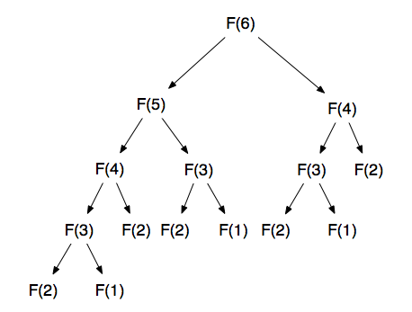

# 재귀 맵 폴드

## 이 장의 목표

- 재귀 함수로 알고리즘 구성하기
- purescript std lib 소개(map, fold, filter, concatmap)

## 프로젝트 준비

의존성

- maybe
- arrays
- strings
- foldable-traversable
- console

## 소개

재귀는 순수fp에서 중요

- 많은 가변 강태를 줄일 수 있게 한다
- 재귀는 분할 정복 전략과 긴밀한 연관이 있음

팩토리얼 예제

```purescript
factorial :: Int -> Int
factorial n =
  if n == 0 then
    1
  else
    n * factorial (n - 1)
```


피보나치 예제

```purescript
fib :: Int -> Int
fib n =
  if n == 0 then
    0
  else if n == 1 then
    1
  else
    fib (n - 1) + fib (n - 2)
```

위의 if/else 대신 pattern matching을 쓰세요(이는 나중에 나옴)

## 배열에 재귀하기

배열이 비어있는지 아닌지에 따라서 분기가 나뉘는 재귀로 배열 길이 재기

```purescript
import Prelude
import Data.Array (null, tail)
import Data.Maybe (fromMaybe)

length :: forall a. Array a -> Int
-- array<T> -> Int
length arr =
  if null arr then -- 배열이 비어있으면
    0 -- 빵
  else -- 아니면
    1 + length $ fromMaybe [] $ tail arr)
  {-
    arr 의 h::t 에서의 t의,
    만약 t 가 Nothing이라면 []의
    길이를 1에 더함
    tail :: forall (a::Type). Array a -> Maybe (Array a)
    fromMaybe :: forall (a::Type). a -> Maybe a -> a
      Option.getWithDefault의 data-last 버전
  -}
```

## 맵

우리가 아는 그 맛

map의 타입

```purescript
forall (f :: Type -> Type) (a :: Type) (b :: Type). Functor f => (a -> b) -> f a -> f b
{-
  타입을 인자로 받고 타입을 반환하는 f와
  타입 a 와
  타입 b 에 대해서

  f 가 펑터 클래스의 타입일때(map을 멤버로 가지는 타입)
  https://pursuit.purescript.org/packages/purescript-prelude/3.1.0/docs/Data.Functor#t:Functor

  (a->b 인 함수 타입)과
  (a 를 타입 인자로 가지되, map을 멤버 함수로 가지는 타입)을 인자로 받고
  (b 를 타입 인자로 가지되, map을 멤버 함수로 가지는 타입)을 반환한다.
-}
```

map 쓰기

```purescript
import Prelude
map (\n->n+1) [1,2,3,4,5]
--[2,3,4,5,6]
```

`<$>`처럼 infix로 쓸 수도 있음

```purescript
import Prelude
(\n->n+1) <$> [1,2,3,4,5] -- alternative form of code above

```

`(<$>)` 처럼 써서 prefix op로 쓸수도 있음

```purescript
import Prelude
(<$>) (\n->n+1) [1,2,3,4,5] -- alternative form of code above
```

Data.Array.length 는 `..` 형태의 alias가 있음

```purescript
import Data.Array
1 .. 5
-- equivalent to [1,2,3,4,5]
```

infix op 는 자연어처럼 쓸 수 있게 해서 도메인 특화 언어들을 표현하는데 좋지만, 과도하게 쓰면 가독성을 해칠 수 있음.

`<$>` 는 우결합임

```purescript
> import Data.Array ((..))
> (\n->n+1) <$> (\n->n*2) <$> 1..5

[3,5,7,9,11]
```

## 배열 필터링하기

우리가 아는 그 맛 #2

```purescript
import Data.Array
filter(\n->n `mod` 2 == 0) (1..10)
```

Data.Array.filter의 타입

```purescript
> :type filter
forall (a :: Type). (a -> Boolean) -> Array a -> Array a
```

## 배열 평탄화

배열의 또다른 std lib은 concat이 있다.
(다른 곳에서 주로 Array.flatten 등으로 쓰이던)

```purescript
import Data.Array
:type concat
forall (a :: Type). Array (Array a) -> Array a

concat [[1, 2, 3], [4, 5], [6]]
--[1, 2, 3, 4, 5, 6]
```

이와 관련된 `concatMap`이 있다.

- Array.prototype.flatMap

map, filter, concatMap은 array와 관련된 array comprehension의 기반이 된다

## Do 노테이션

코드의 가독성을 높이기 위한 do notation이라는 것이 있다

```purescript
factors :: Int->Array (Array Int)
factors n = filter (\xs -> product xs == n) do
  i <- 1 .. n
  j <- i .. n
  pure [i,j]
```

`do` 키워드는 코드 블럭을 만듬
`<-` 연산자를 통해 왼쪽의 이름에 표현식을 바인딩할 수 있음

pure는 이런 친구

```purescript
import Prelude
:type pure
forall (f :: Type -> Type) (a :: Type). Applicative f => a -> f a

{-
타입 생성자 f 와 타입 a 에 대해서
f 가 Applicative 타입이라면
a를 받아서 f a 를 반환한다.

Applicative는 apply를 가지는 마그마(?)
=> 그냥 apply 한 것 아닌가 싶다

pure [i,j]는 바인딩 하지 않는 연산
-}
```

막상 보니 잘 이해가 안감..
fsharp equivalent는 computation expression

computerphile의 [`what is monad`](https://www.youtube.com/watch?v=t1e8gqXLbsU)에서 본 적이 있음

e.g. safediv의 연산에 대해서

```
eval :: Expr -> Maybe Int
eval (Val n) = return n
eval (Div x y) = do
  n <- eval x
  m <- eval y
  safediv n m

is equivalent to

eval :: Expr -> Maybe Int
eval (Val n) = return n
eval (Div x y) =
  eval x >>= (λn ->
  eval y >>= (λm ->
    safediv n m  ))
```

i.e. do 는 

## 가드

위의 코드에서 filter를 array comprehension에 넣을 수 있는 방법으로는 guard 가 있다.  
guard는 `Control.Alternative`  에 있다.

```purescript
import Control.Alternative (guard)
factorsV3 :: Int -> Array (Array Int)
factorsV3 n = do
  i <- 1 .. n 
  j <- i .. n
  guard $ i * j == n pure [i,j]
```

guard 는 이런 친구

```purescript
> :type guard
forall (m :: Type -> Type). Alternative m => Boolean -> m Unit
{-
  타입 생성자 m 에 대해서
  m 이 Alternative 타입일때

  Boolean을 입력받아 m Unit을 반환함

  Alternative는 Applicative와 Plus 타입을 곱한 것(? 잘모르겠지만, 두개를 다 생성자 인자로 받음)
-}
```

guard는 조건에 부합하지 않으면 plus를, 부합하면 applicative를 적용
위의 경우 i*j ==n 이 아니면 empty 가 실행

## 폴드

우리가 아는 그 맛 #3

reduce 연산

```purescript
import Data.Foldable
:type foldl
forall (f :: Type -> Type) (a :: Type) (b :: Type). Foldable f => (b -> a -> b) -> b -> f a -> b
{-
  Foldable은 foldr, foldl, foldMap을 가지는 타입

  타입 생성자 f와
  타입 a, b에 대해서

  f가 Foldable f 일때

  b, a를 인자로 받아 b 타입을 반환하는 함수와
  b 타입과(초깃값)
  fold 할 수 있는 f a 타입을 인자로 받아서 b 타입을 반환
-}
```

foldl은 일반적인 reduce,

foldr은 iterable의 element가 역순으로 feed 됨

## 꼬리재귀

(최고!)

공짜로 재귀하기, 재귀 호출 시 스택 프레임을 생성하지 않음. 
모든 누적 불변 상태를 인자로 넘겨주면 재귀 연산의 공간 비용이 공짜.

그러나 js에서는... ECMAScript6 스펙에는 있지만 웹킷 브라우저만 됨.
v8엔진에는 있었다가, 디버깅 이슈(스택 트레이스를 읽기 힘들다는 이유)로
명시적인 tail call semantic을 통한 꼬리재귀를 지원하려고 했고(syntactic tail call) 빠짐.
https://stackoverflow.com/a/54721813

그렇기 때문에 purescript는 while 루프로 컴파일함

(free, tailrec, trampoling 라이브러리들도 볼 것)

모든 함수를 재귀로 짜고 싶을 수 있지만, map, fold, filter를 쓰면 코드가 읽기 좋다.

## 가상 파일 시스템

Data.Path 모듈은 가상 파일 시스템을 만드는 데 필요한 API를 정의하고 있음
- Path
- root :: Path
- ls :: Path -> Array Path
- filename :: Path -> string
- size :: Path -> Maybe Int
- isDirectory :: Path -> Boolean
