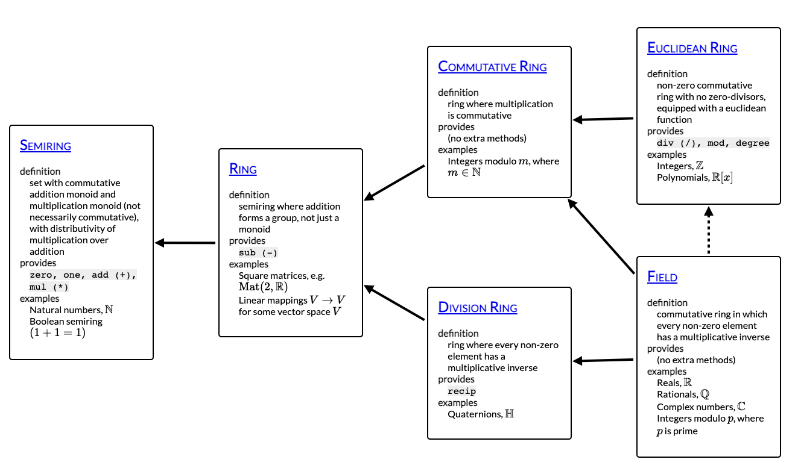

# 타입 클래스

## 챕터의 목표

- 타입클래스라는 퓨어스크립트의 타입시스템에 의한 강력한 형태의 추상 소개

## 보여주세요!

타입 클래스의 첫 예시는 `show` 함수이다. 값을 인자로 받아 string을 반환한다.  
`show` 는 Prelude모듈에 `Show`라는 모듈 이름으로 타입 클래스로 선언되어 있다.

```purescsript
class Show a where
  show :: a -> String
```

위의 코드는 타입 변수 a를 받는 `Show` 라는 새 타입 클래스를 선언한다.

타입 클래스 인스턴스는 타입클래스에 정의된 메소드를 특정한 타입으로 특화된 형태로 가지고 있다.

예를 들어, Boolean 값에 대한 Show 타입 클래스 인스턴스는 다음과 같다.

```purescript
instance showBoolean :: Show Boolean where
  show true = "true"
  show false = "false"
```

퓨어스크립트에서는 타입 클래스 인스턴스는 생성될 Javascript의 가독성을 높이기 위해 이름을 지정할 수 있습니다.

이 show는 다양한 원시 타입 및 복잡한 타입에도 사용할 수 있습니다.

```purescript
> import Prelude

> show true
"true"

> show 1.0
"1.0"

> show "Hello World"
"\"Hello World\""

> import Data.Tuple

> show (Tuple 1 true)
"(Tuple 1 true)"

> import Data.Maybe

> show (Just "testing")
"(Just \"testing\")"
```

만약 Either 타입에 대해서 show를 하려 하면 다음과 같은 에러를 맞이할 수 있습니다.

```purescript
> import Data.Either
> show (Left 10)

The inferred type

    forall a. Show a => String

has type variables which are not mentioned in the body of the type. Consider adding a type annotation.
```

이 경우에는 Show의 인스턴스 중 우리가 의도한 show에 대응하는 타입이 없는 것이 아닌, PSCi가 해당 타입을 추론하지 못한 경우입니다.  
이는 **unknown type a** 로 추론됩니다.

이 경우는 `::` 연산자를 이용하여 PSCi 가 올바른 타입 인스턴스를 선택하게끔 할 수 있습니다.

```purescript
> show (Left 10 :: Either Int String)
"(Left 10)"
```

어떤 타입은 아예 해당 타입에 대한 Show 가 정의되지 않았을 수도 있습니다. 하나의 예로는 함수 타입 `->` 입니다.  
만약 `Int->Int` 함수를 show 하려고 하면, 타입 체커에게 다음과 같은 메시지를 받을 수 있습니다.

```purescript
> import Prelude
> show $ \n -> n + 1

No type class instance was found for

  Data.Show.Show (Int -> Int)
```

타입 클래스는 둘 중 한군데에서 정의될 수 있습니다.

- 타입 클래스가 정의된 곳과 같은 모듈
- 타입 클래스에 속하는 타입이 정의된 곳과 같은 모듈

이 외의 곳에서 정의된 인스턴스는 모두 `고아 인스턴스` 라 불리며, 퓨어스크립트 컴파일러에서 허용되지 않습니다.

## 일반적인 타입 클래스

이 장에서는 Prelude와 표준 라이브러리에 정의된 표준 타입 클래스들을 소개합니다.

### Eq

Eq 타입 클래스는 동등성을 검사합니다. `==` 연산자는 `eq`의 alias입니다.

```purescript
class Eq a where
  eq :: a -> a -> Boolean
```

### Ord

Ord 타입클래스는 compare 함수를 정의합니다. 이는 두 값을 비교하는 데에 사용하며, 정렬을 지원하는 타입들을 지원하는 데에 사용합니다.
비교 연산자 `>` `<` 와 엄격하지 않은 동반자 `<=` `=>`들은 `compare`의 이름으로 정의할 수 있습니다.

```purescript
data Ordering = LT | EQ | GT

class Eq a <= Ord a where
  compare :: a -> a -> Ordering
```

`compare` 함수는 두 값을 비교하고 `Ordering` 을 반환합니다.

- LT : 첫 인자가 두번째 인자보다 작음
- EQ : 두 인자가 같음
- GT : 첫 인자가 두번째 인자보다 큼

### Field

Field 타입클래스는 사칙연산을 지원하는 타입을 식별합니다.  
적절한 경우에 재사용되어질 수 있도록 이 연산자들을 추상화하기 위해서 제공됩니다.

> 노트: Eq 나 Ord 타입 클래스와 같이, Field 타입 클래스는 Purescript 컴파잉러 내부의 특별한 지원을 받습니다.
> 따라서 1 + 2 \* 3 과 같은 간단한 표현식은 타입 클래스 구현체에 따라 디스패치되는 함수 호출과 달리, 간단한 Js로 변환됩니다.

```purescript
class EuclideanRing a <= Field a
```

Field 타입클래스는 몇몇 상위 클래스들의 조합으로 구성되어 있습니다.  
이는 Field 연산의 전부가 아닌 일부만을 지원하는 추상적인 타입을 논할 수 있게 합니다.  
예를 들어, 자연수는 덧셈과 곱셈에 대해서는 닫혀 있을 수 있지만, 뺄셈에는 그렇지 않습니다.  
따라서 이 타입은 `Field`나 `Ring`의 인스턴스가 아닌, `Semiring`클래스(`Num`의 상위 클래스)의 인스턴스를 가져야 합니다.

상위 클래스는 본 장의 뒤에서 설명될 것이지만, `수 타입 클래스 계층`은 이 장의 범위를 벗어납니다.



### 반군과 모노이드

`Semigroup` 타입 클래스는 append 연산을 지원하는 타입을 식별합니다.

```purescript
class Semigroup a where
  append :: a -> a -> a
```

concat 연산자 `<>` 는 `append` 의 alias 입니다.

`Monoid` 타입 클래스는 해당 타입으로 "빈" 값으로부터 시작해서, 새 결과를 조합하는 `누적`을 어떻게 할 수 있는지를 설명한 타입을 식별합니다.  
예를 들어, fold를 이용하여 배열의 값들을 연결하는 함수를 작성할 수 있습니다.

(Semigroup + empty value)

```purescript
import Prelude
import Data.Monoid
import Data.Foldable

> foldl append mempty ["Hello", " ", "World"]
"Hello World"

> foldl append mempty [[1,2,3],[4,5],[6]]
[1,2,3,4,5,6]
```

### Foldable

모노이드 타입 클래스가 fold의 결과 타입과 같이 동작하는 타입들을 식별한다면, Foldable은 어떤 타입 생성자들이 fold의 소스로 사용될 수 있는지를 식별하는 타입 클래스입니다.

`Foldable` 타입 클래스는 `foldable-traversable` 패키지에서 제공되며, 이는 배열이나 Maybe와 같은 일반적인 컨테이너를 위한 인스턴스 또한 포함하고 있습니다.

Foldable 클래스에 속하는 함수들의 타입 시그니쳐는 기존에 봤던 것들보다는 조금 더 복잡합니다

```purescript
class Foldable f where
  foldr :: forall a b. (a->b->b)->b->f a -> b
  foldl :: forall a b. (b->a->b)->b->f a -> b
  foldMap :: forall a m. Monoid m => (a->m) -> f a -> m
```
